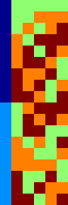

Data representation
===================

All designs handled by the OApackage are integer valued. The designs (whether these are ortogonal arrays, optimal designs or conferences designs)
are stored in an :meth:`array_link` object.

An orthogonal array (OA) of strength :math:`{t}`, :math:`{N}` runs and
:math:`{n}` factors at :math:`{s}` levels is an :math:`{N}\times {n}`
array of :math:`0,
\ldots,({s}-1)`-valued symbols such that for every :math:`{t}` columns
every :math:`{t}`-tuple occurs equally
often :cite:`Rao1947`. The set of all OAs with given
strength, runs and levels is denoted by
:math:`{\operatorname{OA}({N}; {t}; {s}^{n})}`. The OAs are represented
by arrays (in column-major form).

Data structures
---------------

The package contains several data structures. Here we describe the main
structures and their use.

  :meth:`~oalib.array_link`
    The structure containing an orthogonal array is called the
    :meth:`~oalib.array_link` structure. Lists of arrays are stored in the
    :meth:`~oalib.arraylist_t` object, which is implemented as a :code:`std::deque` container.

  :meth:`~oalib.arrayfile_t`
    This is an object that allows for reading and writing of arrays to
    disk.

  :meth:`~oalib.arraydata_t`
    The structure describing a certain class of orthogonal arrays or
    optimal designs.

  :meth:`~oalib.conference_t`
    The structure describing a certain class of conference designs.

  :meth:`~oalib.array_transformation_t`
    This describes a transformation of an orthogonal array. This includes the row-,
    column- and level-permutations.

  :meth:`~oalib.conference_transformation_t`
    This describes a transformation of an array. This includes the row-,
    and column permutations and row- and column sign switches.

Representing arrays
-------------------

The structure containing an orthogonal array is called the
:class:`~oalib.array_link` structure. It consists of a specified number of rows and
columns, the data (integer valued) and an index.
        
In the Python interface the :meth:`array_link` object can be indexed just as
normal arrays. It is also possible to convert to a Numpy array. The
:class:`~oalib.array_link` object implements to Python array interface, so most
opertations from packages such as Numpy work on the :meth:`~oalib.array_link`
object.

.. code-block:: python
 :caption: Array representation in Python

 >>> import oapackage
 >>> al=oapackage.exampleArray(0)
 >>> al.showarray() 
 array: 0 0 0 0 0 1 0 1 1 0 1 0 1 1 1 1 
 >>> al[2,1] 
 1L 
 >>> X=np.array(al)
 >>> X 
 array([[0, 0], [0, 0], [0, 1], [0, 1], [1, 0], [1, 0], [1, 1], [1, 1]], dtype=int32)

The C++ class is:

.. doxygenstruct:: array_link
    :outline:
    :no-link:

    
Reading and writing arrays
--------------------------

Reading and writing arrays to disk can be done with the :meth:`oalib.arrayfile_t`
class. For example:

.. code-block:: python
   :caption: Write an array to disk

   >>> import oapackage
   >>> al=oapackage.exampleArray()
   >>> af=oapackage.arrayfile_t('test.oa', al.n_rows, al.n_columns)
   >>> af.append_array(al)
   >>> print(af)
   file test.oa: 8 rows, 2 columns, 1 arrays, mode text, nbits 8
   >>> af.closefile()

The arrays can be written in text or binary format. For more details on
the file format see Section :ref:`File formats`.

The Python interface is :meth:`oalib.arrayfile_t` and the C++ interface is

.. see https://breathe.readthedocs.io/en/latest/directives.html

.. doxygenstruct:: arrayfile::arrayfile_t

Array transformations
---------------------

Transformations of (orthogonal) arrays consist of row permutations,
level permutations and level transformations. A transformation is
represented by the :meth:`~oalib.array_transformation_t` object.

For a given transformation the column permutations are applied first,
then the level permutations and finally the row permutations. The level-
and column permutations are not commutative.

.. code-block:: c++

    class array_transformation_t
    {
    public:
        rowperm_t   rperm;      /// row permutation
        colperm_t   colperm;    /// column permutation
        levelperm_t *lperms;    /// level permutations
        const arraydata_t *ad;  /// type of array

    public:
        array_transformation_t ( const arraydata_t *ad );
        array_transformation_t ( );     /// default constructor
        array_transformation_t ( const array_transformation_t  &at );   
        array_transformation_t & operator= ( const array_transformation_t &at );    
        ~array_transformation_t();  /// destructor

        /// show the array transformation
        void show() const;

        /// return true if the transformation is equal to the identity
        bool isIdentity() const;

        /// return the inverse transformation
        array_transformation_t inverse() const;

        /// return the transformation to the identity transformation
        void reset();

        /// initialize to a random transformation
        void randomize();

        /// initialize with a random column transformation
        void randomizecolperm();

        /// apply transformation to an array_link object
        array_link apply ( const array_link &al ) const;

        /// composition operator. the transformations are applied from the left
        array_transformation_t operator*(const array_transformation_t b);
        
        ...

Classes of arrays
-----------------

The :meth:`~oalib.arraydata_t` object represents data about a class of orthogonal
arrays, e.g. the class :math:`{\operatorname{OA}(N; t; s^k)}`.

.. code-block:: c++

    struct arraydata_t
    {
        rowindex_t N;   /** number of runs */
        array_t *s; /** pointer to levels of the array */
        colindex_t ncols; /** total number of columns (factors) in the design */
        colindex_t strength;    /** strength of the design */

        ordering_t  order; /** Ordering used for arrays */

    public:
        /// create new arraydata_t object
        arraydata_t(std::vector<int> s, rowindex_t N_, colindex_t t, colindex_t nc);
        arraydata_t(carray_t *s_, rowindex_t N_, colindex_t t, colindex_t nc);
        arraydata_t(const arraydata_t &adp);
        
        ...
        
        /// return true if the array is of mixed type
        bool ismixed() const;
        /// return true if the array is a 2-level array
        bool is2level() const;
        /// set column group equal to that of a symmetry group
        void set_colgroups(const symmetry_group &sg);
            /// return random array from the class
        array_link randomarray ( int strength = 0, int ncols=-1 ) const;

    }

File formats
------------

The Orthogonal Array package stores arrays in a custom file
format. There is a text format with is easily readable by humans and a
binary format with is faster to process and memory efficient.

Plain text array files
~~~~~~~~~~~~~~~~~~~~~~

Arrays are stored in plain text files with extension ``.oa``. The first line
contains the number of columns, the number of rows and the number of
arrays (or -1 if the number of arrays is not specified). Then for each
array a single line with the index of the array, followed by N lines
containing the array.

A typical example of a text file would be:

.. code-block:: c

  5 8 1
  1
  0 0 0 0 0
  0 0 0 1 1
  0 1 1 0 0
  0 1 1 1 1
  1 0 1 0 1
  1 0 1 1 0 
  1 1 0 0 1 
  1 1 0 1 0
  -1

This file contains exactly 1 array with 8 rows and 5 columns.

Binary array files
~~~~~~~~~~~~~~~~~~

Every binary file starts with a header, which has the following format:

.. code-block:: c

  [INT32] 65 (magic identifier) 
  [INT32] b: Format: number of bits per number. Currently supported are 1 and 8
  [INT32] N: number of rows 
  [INT32] k: kumber of columns 
  [INT32] Number of arrays (can be -1 if unknown)
  [INT32] Binary format number: 1001: normal, 1002: binary diff, 1003: binary diff zero
  [INT32] Reserved integer
  [INT32] Reserved integer

The normal binary format has the following format. For each array (the
number is specified in the header):

.. code-block:: c

  [INT32] Index
  [Nxk elements] The elements contain b bits

If the number of bits per number is 1 (e.g. a 2-level array) then the
data is padded with zeros to a multiple of 64 bits. The data of the
array is stored in column-major order. The binary file format allows for
random access reading and writing. The ``binary diff`` and ``binary diff
zero`` formats are special formats.

A binary array file can be compressed using gzip. Most tools in the
Orthogonal Array package can read these compressed files transparently.
Writing to compressed array files is not supported at the moment.

Data files
~~~~~~~~~~

The analysis tool (``oaanalyse``) writes data to disk in binary format.
The format is consists of a binary header:

::

  [FLOAT64] Magic number 30397995;
  [FLOAT64] Magic number 12224883;
  [FLOAT64] nc: Number of rows
  [FLOAT64] nr: Number of columns

After the header there follow ``nc*nr [FLOAT64]`` values.

Command line interface
----------------------

Included in the packages are several command line tools. For each tool
help can be obtained from the command line by using the switch ``-h``.
The tools are:

`oainfo`
    This program reads Orthogonal Array packagedata files and reports
    the contents of the files. For example:

    .. code-block:: console
    
        $ oainfo result-8.2-2-2-2.oa
        Orthogonal Array package 1.8.7
        oainfo: reading 1 file(s)
        file result-8.2-2-2.oa: 8 rows, 3 columns, 2 arrays, mode text, nbits 0
        $

`oacat`
    Show the contents of a file with orthogonal arrays for a data file.

`oacheck`
    Check or reduce an array to canonical form.

`oaextendsingle`
    Extend a set of arrays in LMC form with one or more columns.

`oacat`
    Show the contents of an array file or data file.

    Usage: ``oacat [OPTIONS] [FILES]``

`oajoin`
    Read one or more files from disk and join all the array files into a
    single list.

`oasplit`
    Takes a single array file as input and splits the arrays to a
    specified number of output files.

`oapareto`
    Calculates the set of Pareto optimal arrays in a file with arrays.

`oaanalyse`
    Calculates various statistics of arrays in a file. The statistics
    are described in section :ref:`Properties of designs`.

   Orthogonal array in :math:`\mathrm{OA}(18, 2 3^a, 2)`
