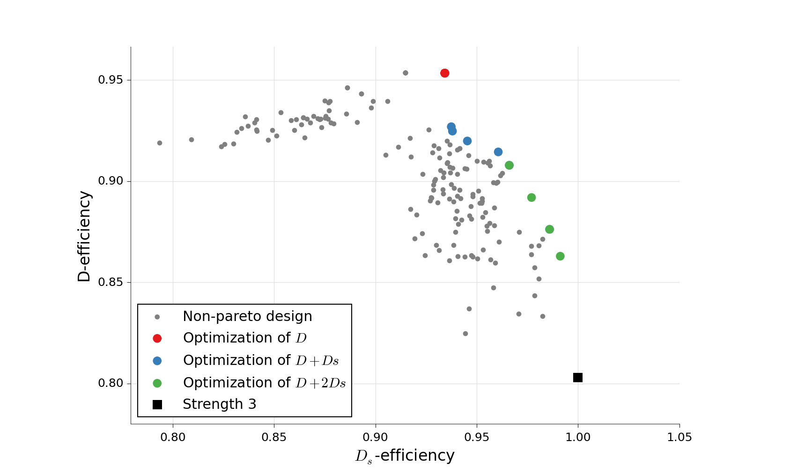

Generation of designs
=====================

The OApackage can be used to generate several classes of arrays. A collection of
arrays generated by the package is available on the website http://www.pietereendebak.nl/oapackage/index.html.
      
        
Generation of orthogonal arrays
-------------------------------

A list of arrays in LMC form (i.e., lexicographically minimum in columns) can be extended to a list of arrays in LMC
form with one additional column. Details about the algorithm are described
in :cite:`Eendebak2009`.

The main function for array extension is the function :cpp:func:`extend_arraylist`. The arguments for this function are the list of arrays
to extend, a specification of the class of arrays in :cpp:class:`arraydata_t` and the
options :cpp:class:`OAextend` for the algorithm.

An example of a session that extends a designs is:

.. doctest::
   
   >>> import oapackage
   >>> N=8; ncols=3;
   >>> arrayclass=oapackage.arraydata_t(2, N, 2, ncols)
   >>> root_array=arrayclass.create_root() 
   >>> root_array.showarraycompact()
   00
   00
   01
   01
   10
   10
   11
   11
   >>> array_list=oapackage.extend_array(root_array, arrayclass)
   >>> print('found %d extensions of the root array' % len(array_list))
   found 2 extensions of the root array

A more detailed example is :ref:`Enumerate orthogonal arrays`.

Conference designs
------------------

An :math:`n\times k` conference design is an :math:`N\times k` matrix
with entries 0, -1, +1 such that i) in each column the symbol 0 occurs
exactly one time and ii) all columns are orthogonal to each other.
For details see :cite:`Schoen2018dsd`, :cite:`wiki:ConferenceMatrix`.

.. admonition:: Generate conference designs with 8 rows

   .. doctest::     
                   
    >>> import oapackage
    >>> conference_class=oapackage.conference_t(8, 6, 0) 
    >>> array = conference_class.create_root_three_columns()
    >>> array.showarray()
    array:
      0   1   1
      1   0  -1
      1   1   0
      1   1   1
      1   1  -1
      1  -1   1
      1  -1   1
      1  -1  -1
    >>> l4=oapackage.extend_conference ([array], conference_class, verbose=0)
    >>> l5=oapackage.extend_conference ( l4, conference_class, verbose=0) 
    >>> l6=oapackage.extend_conference ( l5, conference_class, verbose=0)
    >>> print('number of non-isomorphic conference designs with 6 columns: %d'  % len(l6) )
    number of non-isomorphic conference designs with 6 columns: 11

An example notebook with more functionality is
:ref:`Generation and analysis of conference designs`.
The full interface for conference designs is available
in the :ref:`Interface for conference designs`.

The main functions to extend conference and double conference designs are
:cpp:func:`extend_conference` and :cpp:func:`extend_double_conference`.

The low-level functions for generating candidate extension columns of conference and double conference designs
are :cpp:func:`generateConferenceExtensions` and :cpp:func:`generateDoubleConferenceExtensions`.

Calculation of D-efficient designs
----------------------------------

D-efficient designs (sometimes called D-optimal designs) can be calculated with the function :py:meth:`oapackage.Doptim.Doptimize`.
This function uses a coordinate-exchange algorithm to generate designs
with good properties for the :math:`D`-efficiency.

A Python script to generate optimal designs with 40 runs and 7 factors is shown below.

.. admonition:: Example of Doptimize usage

   .. testsetup::
   
       import oapackage
       oapackage.seedfastrand(123)
       oapackage.set_srand(123)
       
   .. doctest::  

     >>> N=40; s=2; k=7;
     >>> arrayclass=oapackage.arraydata_t(s, N, 0, k) 
     >>> print('We generate optimal designs with: %s' % arrayclass)
     We generate optimal designs with: arrayclass: N 40, k 7, strength 0, s {2,2,2,2,2,2,2}, order 0
     >>> alpha=[1,2,0] 
     >>> scores, dds, designs, ngenerated = oapackage.Doptimize(arrayclass, nrestarts=40, optimfunc=alpha, selectpareto=True, verbose=0)
     Doptimize: iteration 0/40
     Doptimize: iteration 39/40
     >>> print('Generated %d designs, the best D-efficiency is %.4f' % (len(designs), dds[:,0].max() ))
     Generated 10 designs, the best D-efficiency is 0.9198

The parameters of the :meth:`~oapackage.Doptim.Doptimize` function are documented in the code.

To calculate efficiencies of the designs we can use the method :cpp:func:`Defficiencies`, to calculate the :math:`D`-, :math:`D_s`- and :math:`D_1`-efficiency.
For details of the efficiencies see the section :ref:`Optimality criteria for D-efficient designs` and :cite:`EendebakSO`.

    
In :cite:`EendebakSO` it is shown that one can optimize a linear combination of the
:math:`D`-efficiency and :math:`D_s`-efficiency to generate a rich 
set of optimal designs with various efficiency. From the generated designs the optimal ones accoring
to Pareto optimality can be selected.

   Scatterplot for the :math:`D`-efficiency and :math:`D_s`-efficiency
   for generated designs in :math:`{\operatorname{OA}(40; 2; 2^7)}`. The
   Pareto optimal designs are colored, while the non-Pareto optimal
   designs are grey. For reference the strength-3 orthogonal array with
   highest D-efficiency is also included in the plot.

Even-odd arrays
---------------

The even-odd arrays are a special class of orthognal arrays with at least one of the odd :math:`J`-characteristics unequal to zero.
More information on this class of designs will appear later.
